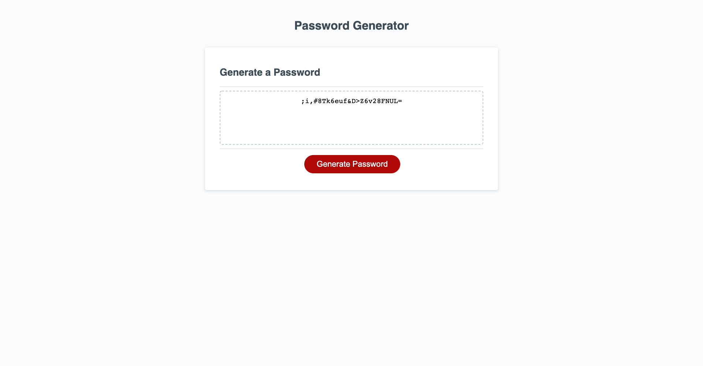

# Password-Generator

## Table of Contents
1. [Description](#discription)
2. [Respository](#respository)
3. [Visuals](#visuals)

## Description
Random Password Generator created with Javascript!

- Steps and guide through the inner workings of this Generator
    1. Started with declaring our gobal elements.
    2. Created prompts to generate feedback from our users.
    3. Set up alerts incase the information they presented didnt fit our critera.
    4. Declared our Varables and assigined them with arrays so we can store the information for our generator.
    5. Made a Variable for our Aarays so that we can pull infromation from them.
    6. Manipulated our IF statments to push the list into the random generator when the user slected them.
    7. Stored a variable with an empty string to help setup our FOR loop for the generated password.
    8. Manipulated our FOR statement to randomize our generator and return it.

## Respository 

- [Respository](https://github.com/VarunTanna/Password-Generator)

- [LIVE SITE](https://varuntanna.github.io/Password-Generator/)

## Visuals

